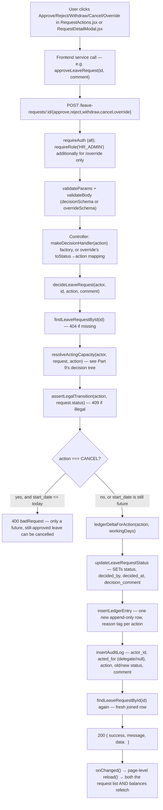

# Workflow — leave application, decisions & HR reporting

> Part of the [Architecture & Workflow Reference](README.md). If this disagrees with the code, the code wins.

---

## Module workflows — index, and HR reporting/CSV

### Part 10 — Complete Module Workflows (index)

Every module actually present in the codebase, cross-referenced to its full trace below:

- **Accounts, roles, reporting** → [07-workflow-employee-onboarding.md](04-workflow-onboarding-and-verification.md).
- **Document upload & profile verification** → [08-workflow-documents-and-verification.md](04-workflow-onboarding-and-verification.md).
- **Payroll run & payslips** → [11-workflow-payroll-and-payslips.md](06-workflow-payroll-and-notifications.md).
- **Leave request submission** → [09-workflow-leave-application.md](05-workflow-leave-and-reporting.md).
- **Leave approval / rejection / HR override / withdraw / cancel** → [10-workflow-leave-decisions.md](05-workflow-leave-and-reporting.md).
- **Leave balance** → embedded in the two leave workflows (it's not a standalone workflow — every balance change is a side effect of a decision action, computed live from the ledger, never a separate "update balance" call).
- **Delegation** → [10-workflow-leave-decisions.md](05-workflow-leave-and-reporting.md)'s delegate sub-trace, plus the timer-driven start/end notifications in [12-workflow-notifications-and-email.md](06-workflow-payroll-and-notifications.md).
- **Authentication & authorization** → [05-auth-and-authorization.md](03-auth-and-authorization.md).
- **HR dashboard / reporting (CSV)** → traced below.
- **Notifications** → in-app (`notifications` table + bell) for everything, plus **three** outbound email paths, all going through `config/mailer.js` (Brevo's HTTP API — SMTP is unusable from Render, which blocks 587 and 465) and each individually switchable via `config/mailFeatures.js`: the **password-reset link** (the only flow with no alternative delivery — returning the link in an API response would let anyone reset anyone's password), the **invite link** (also still returned to HR as a fallback, so this one degrades rather than breaks when mail is off), and the **payslip PDF** after a confirmed payroll run (attached, so it previews and downloads inside the mail client; the in-app notification and the download endpoint remain the non-email path). No SMS or push anywhere.
- **Calendar** → `MyLeaveCalendar`/`TeamLeaveCalendar`/`HolidayCalendar`, all FullCalendar-backed, fed by whichever list the host page already fetched — no separate calendar API exists.

#### Part 10a — HR reporting/CSV workflow

```text
HrReportsPage.jsx (Leave Report tab)
 ↓ user picks a date range, clicks Generate
getLeaveTakenReport({startDate,endDate}) — client/src/services/leaveRequestService.js
 ↓
GET /api/leave-requests/report?startDate=...&endDate=...
 ↓
requireAuth (router-wide) — no separate role middleware; role check happens inside the controller path
 ↓
validateQuery(leaveTakenReportQuerySchema) — both dates required, endDate >= startDate
 ↓
leaveRequestController.getReport → leaveRequestService.generateLeaveTakenReport(req.user, req.query)
 ↓
subtreeEmployeeIds(actor.id) — HR admin's OWN reporting subtree only (bug fixed post-launch: this
                                 used to be unscoped, letting any HR admin report on any branch)
 ↓
findLeaveTakenReport({startDate,endDate,employeeIds}) — GROUP BY aggregation over APPROVED requests
    overlapping the period, one row per employee: {employee_id, first_name, last_name, role, request_count, total_days_taken}
 ↓
Response: [{...}] → rendered as an on-screen table
 ↓
"Download CSV" link → GET /api/leave-requests/report/csv (same params, same aggregation) →
    text/csv attachment, Content-Disposition filename="leave-report-<start>-to-<end>.csv"
```

A request only partially overlapping the period is counted **in full**, not pro-rated — a documented simplification, same category as the year-boundary balance-debit rule.

---

---

## Workflow — applying for leave

### Part 12 — Leave Application Workflow (extreme detail)

Traced from `client/src/components/leave/RequestLeaveForm.jsx` (opened in a `Modal` from `MyBalancesPage.jsx`) through to the database and back.

```text
Employee opens the "Request Leave" modal
        ↓
Form loads leave types on mount — getLeaveTypes()
        ↓
Employee selects a leave type, dates, half-day flags, writes a reason,
    (optionally) attaches a document
        ↓
CLIENT-SIDE checks (mirror, never replace, server validation):
  1. endDate < startDate → inline error
  2. single-day request with BOTH half-day flags set → inline error
  3. selected leave type's requires_document is true and no file attached → inline error
        ↓
LIVE PREVIEW — fires on every relevant field change (debounced via the effect's own dependency array):
    previewLeaveRequest({startDate,endDate,startHalfDay,endHalfDay})
        ↓ POST /api/leave-requests/preview
    (no role gate beyond requireAuth; a pure, side-effect-free calculation, no DB write)
        ↓
    validateBody(previewLeaveRequestSchema) — date-format + endDate>=startDate
        ↓
    leaveRequestController.preview → leaveRequestService.previewWorkingDays
        ↓
    findAllHolidays({}) + calculateWorkingDays(...) — workingDayService.js:
        excludes weekends and any date inside a holiday's [start_date,end_date] range,
        then subtracts 0.5 per boundary half-day flag ONLY IF that boundary date is
        itself a working day (a half-day flag on a weekend/holiday boundary is a no-op)
        ↓
    Response: { workingDays: 4.5 } → shown to the employee before they submit —
        THE SAME calculation the real submission uses, so the number is never a guess
        ↓
Employee clicks Submit
        ↓
submitLeaveRequest(form, documentFile) — client/src/services/leaveRequestService.js:
    builds multipart/form-data (Content-Type left undefined so the browser sets its own
    boundary) if a file is attached, else plain JSON
        ↓ POST /api/leave-requests
        ↓
uploadLeaveRequestDocument middleware (multer, memory storage, 5MB limit, field "document")
    runs BEFORE validateBody, since it's what turns the multipart body into req.body
        ↓
validateBody(submitLeaveRequestSchema) — leaveTypeId UUID, date strings, half-day flags
    coerced from multipart's stringified "true"/"false", reason non-empty, endDate>=startDate
        ↓
leaveRequestController.submit → leaveRequestService.submitLeaveRequest(req.user.id, req.body, req.file)
    (employee_id is ALWAYS req.user.id — never taken from the request body)
        ↓
SERVER-SIDE VALIDATION ORDER (exact, from leaveRequestService.js):
  1. findLeaveTypeById — 400 if missing or !is_active
  2. leaveType.requires_document && !file → 400
  3. detectFileType(file.buffer) — magic-byte sniff (PDF %PDF-, JPEG FFD8FF, PNG signature);
     NOT in {pdf,jpeg,png} → 400 "Document must be a PDF, JPG or PNG file"
     (never trusts the client-reported extension or Content-Type)
  4. calculateWorkingDays(...) — 400 if the result is <= 0
  5. findOverlappingLeaveRequest({employeeId,startDate,endDate}) — 409 if it overlaps an
     existing SUBMITTED/APPROVED request of the SAME employee
  6. Balance check: year resolved from startDate (year-boundary debit rule — a request
     spanning two years is debited against its START date's year), seedBalancesForUser
     (self-heal), getBalanceForUserAndType; 400 "This request would take your balance
     below zero" UNLESS leaveType.allow_negative_balance
        ↓
  7. ONLY IF ALL OF THE ABOVE PASSED: Cloudinary upload (cloudinaryService.js) — private
     `type:"authenticated"` asset, resource_type raw for PDF / image for JPG/PNG. This
     order matters: nothing has touched Postgres yet at this point, so a Cloudinary
     failure never leaves a half-created request behind.
  8. insertLeaveRequest(...) — INSERT INTO leave_requests (...)
  9. insertLeaveRequestDocument(...) — only if a document was uploaded; stores
     cloudinary_public_id/cloudinary_resource_type, NEVER a URL
 10. insertLedgerEntry({..., pendingDelta: workingDays, takenDelta: 0, reason:"SUBMIT"})
 11. insertAuditLog({..., action:"SUBMIT", oldStatus:null, newStatus:"SUBMITTED"})
        ↓
Response: 201 { success:true, message:"Leave request submitted", data:<joined request row> }
        ↓
Frontend: onSubmitted(created) → modal closes, calendar's focusDate jumps to the new
    request's start date, reload() bumps reloadToken → balances + "my requests" +
    holidays all refetch, MyLeaveRequestList/MyLeaveCalendar re-render
```

#### Failure scenarios, by layer

| Failure | Status | Where caught |
|---|---|---|
| Leave type inactive/not found | 400 | `submitLeaveRequest` step 1 |
| Required document missing | 400 | step 2 |
| Document isn't actually a PDF/JPG/PNG (by content, not extension) | 400 | step 3 |
| Date range has zero working days (e.g. a single weekend day) | 400 | step 4 |
| Overlaps an existing pending/approved request | 409 | step 5 |
| Balance would go negative and the type disallows it | 400 | step 6 |
| File exceeds 5MB | 400 (Multer `LIMIT_FILE_SIZE` → mapped by `errorHandler`) | upload middleware, before the controller even runs |
| Malformed body (bad UUID, missing reason, etc.) | 422 | `validateBody`, before the controller runs |

---

---

## Workflow — approve / reject / override / withdraw / cancel

### Part 13 — Leave Approval / Rejection / Override / Withdraw / Cancel Workflow

All five decision actions share one code path — `decideLeaveRequest(actor, requestId, action, comment)` in `services/leaveRequestService.js` — differing only in the `action` string and two small per-action lookup tables. This is the single most important piece of business logic in the codebase to be able to explain fluently.



#### The two lookup tables that differentiate every action

```js
// server/src/services/leaveRequestService.js
function ledgerDeltaForAction(action, workingDays) {
    switch (action) {
        case "APPROVE":                 return { pendingDelta: -workingDays, takenDelta: workingDays };
        case "REJECT":
        case "WITHDRAW":                return { pendingDelta: -workingDays, takenDelta: 0 };
        case "CANCEL":                  return { pendingDelta: 0,            takenDelta: -workingDays };
        case "HR_OVERRIDE_TO_APPROVED": return { pendingDelta: 0,            takenDelta: workingDays };
        case "HR_OVERRIDE_TO_REJECTED": return { pendingDelta: 0,            takenDelta: -workingDays };
    }
}
// Ledger "reason" tag per action:
// APPROVE→"APPROVE", REJECT→"REJECT", WITHDRAW→"WITHDRAW", CANCEL→"CANCEL",
// HR_OVERRIDE_TO_APPROVED→"HR_OVERRIDE_APPROVE", HR_OVERRIDE_TO_REJECTED→"HR_OVERRIDE_REJECT"
```

#### Comparison table — every decision action

| Action | State transition | Who can act (`resolveActingCapacity`) | `pending_delta` | `taken_delta` | Audit `action` value |
|---|---|---|---|---|---|
| Approve | SUBMITTED → APPROVED | direct manager, active delegate, or HR (own subtree) | `-workingDays` | `+workingDays` | `APPROVE` |
| Reject | SUBMITTED → REJECTED | same as Approve | `-workingDays` | `0` | `REJECT` |
| Withdraw | SUBMITTED → WITHDRAWN | **owner only** (404 for anyone else, before any role check) | `-workingDays` | `0` | `WITHDRAW` |
| Cancel | APPROVED → CANCELLED | **owner only**, plus a server-side "start date still in the future" guard | `0` | `-workingDays` | `CANCEL` |
| HR override → approved | REJECTED → APPROVED | HR_ADMIN, own subtree only (dedicated branch, no delegate concept) | `0` | `+workingDays` | `HR_OVERRIDE_TO_APPROVED` |
| HR override → rejected | APPROVED → REJECTED | HR_ADMIN, own subtree only | `0` | `-workingDays` | `HR_OVERRIDE_TO_REJECTED` |

**Why approve/reject share one branch but withdraw/cancel are separate**: the owner-only check for withdraw/cancel runs *before* any role/manager/HR/delegate logic is even reached — an employee's own actions on their own request never touch the manager/HR authorization branch at all. Approve/reject/override, by contrast, explicitly forbid the owner (an employee can never approve their own request, checked first) and then branch by role.

**Why overrides only touch `taken_delta`, never `pending_delta`**: by the time an override happens, the original approve/reject already resolved the pending hold one way or the other — overriding is purely "flip what actually happened," not "re-open a pending decision." The ledger is append-only, so the override posts a *new* row on top of the original decision's row rather than editing it; the balance query's `SUM()` nets them out automatically.

#### Delegate sub-trace — the exact mechanics of "acting on someone's behalf"

1. `isManagerOrDelegateOf(actorId, employeeManagerId)`: `true` immediately if `employeeManagerId === actorId`; otherwise queries `findActiveDelegation({managerId: employeeManagerId, delegateId: actorId, onDate: todayDateKey()})`.
2. Repository SQL (`delegationRepository.js`):
   ```sql
   SELECT id FROM delegations
   WHERE manager_id = $1 AND delegate_id = $2 AND start_date <= $3 AND end_date >= $3
   LIMIT 1
   ```
3. If found, `resolveActingCapacity` computes `actingAsDelegate = request.employee_manager_id !== actor.id` (true, since the delegate isn't literally the manager) and returns `{ actedFor: request.employee_manager_id }`.
4. `decideLeaveRequest` passes that straight into `insertAuditLog({..., actorId: actor.id, actedFor})` — `actor_id` is who physically clicked the button, `acted_for` is the manager they represented. The leave request's own `decided_by` column is *also* the delegate's id (not the manager's) — the manager attribution lives only in the audit trail.
5. `RequestDetailModal.jsx`'s `actorName()` helper renders this as "X (on behalf of Y)" in the history view whenever `acted_for` is set.

**Delegate discovery**: `GET /api/delegations/as-delegate` is deliberately **not** role-gated (a plain `EMPLOYEE` can be nominated as a delegate) — `useActiveDelegation.js` polls this on mount, filters to delegations whose date range covers today, and both `NavBar` (reveals the Approvals nav link to a non-manager) and the `DelegateStatus` dashboard tile key off it. `RequireRole`'s `alsoAllowIfActiveDelegate` prop lets `/dashboard/approvals` admit a currently-delegating employee even though the route is otherwise `MANAGER`/`HR_ADMIN`-only.

**Team-list merging**: `listTeamLeaveRequests(actor)` for a non-HR actor merges the actor's own `findDirectReports(actor.id)` with `findDirectReports(managerId)` for every manager the actor is *currently* delegating for (`findActiveDelegatedManagerIds`) — so a delegate sees the delegated-for team's requests in the same list as their own, labeled "Delegated for X" in `TeamRequestList.jsx` when `employee_manager_id` differs from the viewer.

#### Interview-ready answer

> "Every leave-request decision — approve, reject, withdraw, cancel, HR override — funnels through one function, `decideLeaveRequest`, so there's exactly one place that does the state transition and the balance math, not five copies of similar logic. It first re-fetches the request, then calls `resolveActingCapacity`, which is the single authorization chokepoint: it checks ownership first — an employee can withdraw or cancel their own request but can never approve it — then branches by role: HR only if the employee is in that specific HR admin's own reporting subtree, since we support more than one HR admin, each rooted at a different branch; otherwise it checks if the actor is the direct manager or has an active, date-bounded delegation for that manager. Then it runs the action past a single state-transition map — that's the one place you can see every legal move, so approving an already-cancelled request just isn't representable, it 409s. Then it computes a ledger delta from a small lookup table — approve moves days from pending to taken, reject and withdraw just release the pending hold, cancel returns taken days, and the two override actions flip taken directly since pending was already resolved by the original decision. That ledger entry is append-only, which is also how the balance never drifts — the number you see is always a live `SUM()` over that ledger, never a stored total anyone could accidentally leave stale."

---
